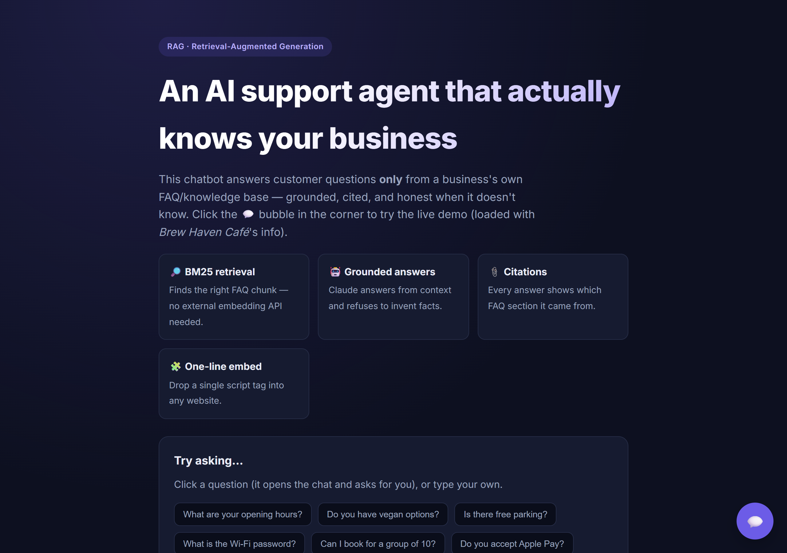
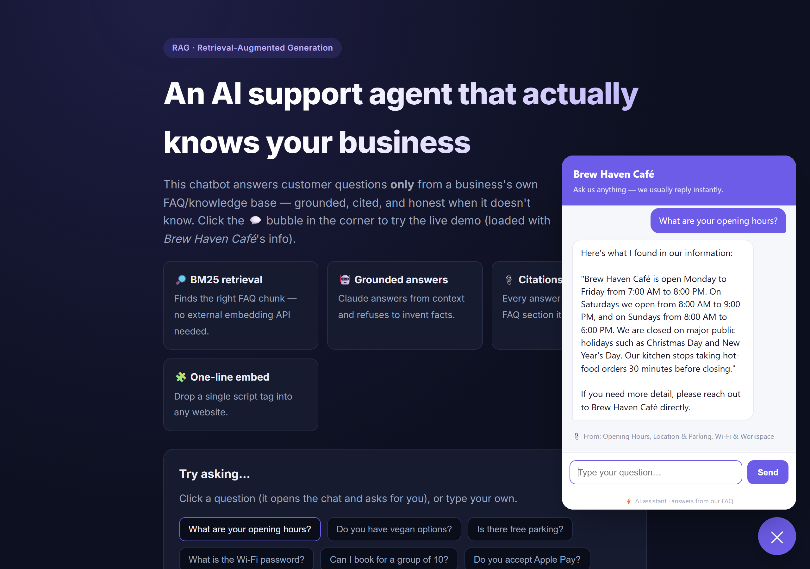

# Support Chatbot (RAG)

An embeddable customer-support chatbot that answers questions using a business's own FAQ content. It retrieves the most relevant sections, answers from them with a citation, and says it doesn't know rather than inventing facts. It drops into any website with a single script tag.


## Overview

This is a retrieval-augmented generation (RAG) chatbot. Retrieval is handled by a BM25 ranking engine written in plain JavaScript, so there is no vector database, no embedding service, and no per-query cost. The retrieved sections are then used to produce a grounded answer.

Answer generation uses the Gemini API when configured; without a key it returns the best-matching FAQ section directly. Either way, answers are constrained to the business's content and every answer shows which section it came from.

## Screenshots

| Landing page | Answering from the FAQ |
| :---: | :---: |
|  |  |

## Why it is built this way

- Grounded and honest: answers come only from the supplied content, and a relevance threshold makes the bot decline questions it has no source for.
- Cited: each answer lists the FAQ section it used.
- Dependency-light: BM25 retrieval needs no external service and runs instantly offline.
- Embeddable: a self-contained `widget.js` injects a floating chat bubble with its own scoped styles, so it never clashes with the host page.

## Getting started

```bash
git clone https://github.com/ramsai676/ai-business-rag-chatbot.git
cd ai-business-rag-chatbot
npm install
npm start
# open http://localhost:3002
```

The demo is pre-loaded with a sample café knowledge base. Try questions like "what are your opening hours?" or "do you have vegan options?". To enable natural-language answers, copy `.env.example` to `.env` and add a `GEMINI_API_KEY`.

Run the tests:

```bash
npm test
```

## Embedding on a website

Host the app, then add one tag to any site:

```html
<script src="https://your-host/widget.js"
        data-api="https://your-host"
        data-name="Your Business"
        data-accent="#6c5ce7"></script>
```

## API

| Endpoint | Body | Purpose |
| --- | --- | --- |
| `POST /api/chat` | `{ "question": "..." }` | Ask the bot. Returns the answer, the sources used, and whether it was grounded. |
| `POST /api/ingest` | `{ businessName, documents }` | Replace the knowledge base at runtime. |
| `GET /api/health` | | Service status and chunk count. |

To use your own content, edit `data/knowledge-base.json` or post documents to `/api/ingest`. Each document is `{ id, title, text }` and is chunked automatically.

## How it works

```
question --> BM25 retrieval --> relevance gate --> grounded answer + citation
             (store.js)         (no match -> "I don't know")   (rag.js)
```

## Tech stack

- Retrieval: a custom BM25 index and tokenizer (stopwords, length normalisation), pure JavaScript
- Backend: Node.js and Express, CORS-enabled for cross-site embedding
- Front end: a zero-dependency embeddable widget plus a demo page
- Tests: built-in `node:test` for chunking and ranking
- Optional Gemini API integration for answer wording, with an extractive fallback

## License

MIT. See [LICENSE](LICENSE).
